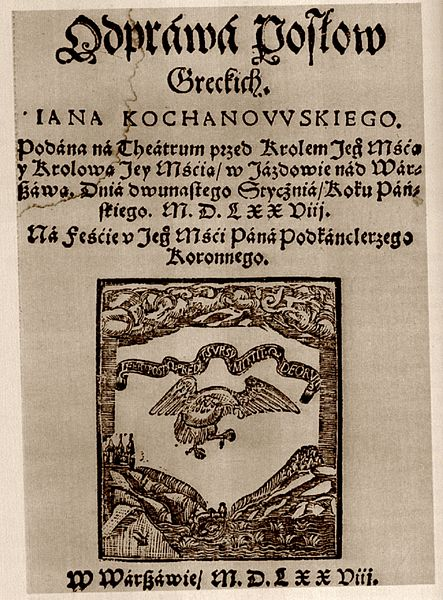

## topics covered today

- Digital Humanities
- Text analysis
- Data
- (Open) Science


# Digital Humanities


## what is Digital Humanities?

get a randomly drawn definition: [https://whatisdigitalhumanities.com/](https://whatisdigitalhumanities.com/)


## Digital Humanities

- library catalogs
- virtual collections
- text analysis
- vision
- folklore studies
- linguistics
- computational literary studies
- ...


## DH emerges

- early journals
    - _Computers and the Humanities_ (1966--2004)
    - _Literary and Linguistic Computing_ (1986--2014)
    - cont. as _Digital Scholarship in the Humanities_ (2015--)
- conferences
    - ALLC/ACH conference (1989--2005)
    - cont. as "Digital Humanities" conference (2006--)
- summer schools
    - Humanities Computing Summer Institute ...
    - ... cont. as Digital Humanities Summer Institute
- textbook _Companion to Digital Humanities_ (2004)


## DH as a big tent

- collecting the data
    - libraries
    - text collections
    - Text Encoding Initiative
- data analysis
    - statistical modeling
    - distant reading
- data curation
- data visualization
- programming
- critical DH


## a few examples

The following is just a small selection of DH projects:

- [Women Writers Project](https://cssh.northeastern.edu/nulab/wwp/)
- [The Devonshire Manuscript](https://en.wikibooks.org/wiki/The_Devonshire_Manuscript)
- [Archaeology of Reading](https://archaeologyofreading.org/)
- [Reframing the Lagoon City as an Archipelago](https://veniss.eu/)
- [US Presidential Elections](https://dsl.richmond.edu/panorama/electingthepresident)
- [Mapping Textual Similarities](https://computationalstylistics.github.io/projects/bootstrap-networks/)


# Text Analysis


## concordances, attributions, ...

- abbot Hugo de Saint-Cher: first concordance (ca 1230)
- Lorenzo Valla: authorship attribution of _The Donation of Constantine_
- Erasmus Roterodamus: attribution of St. Paul's and Seneca's letters
- Roberto Busa: _Index Tomisticus_ (1949--1970)


## concordance to _King James Bible_ (1737)


## Biblical concordance (1526)


## computers and the humanities?

- the Enigma and code-breaking (Rejewski, Zygalski, Różycki)
- Alan Turing
- first computers suitable to count numbers only
- IBM and a Jesuit monk Roberto Busa (late 1940s)


## father Roberto Busa (1913--2011)


## the internet vs. text collections


- page images (no access to the text)
- raw text (no formatting)
- enriched corpora (containing information about structure and/or syntax)


## WBC and similar sources




## small & tidy vs. big & dirty

- Optical character recognition (OCR): an easy way to convert image into text
- However, a considerable number of mistakes might occur
- Vast majority of corpora are OCR-ed and (sometimes) corrected
- Gutenberg Project, Wikisources, etc. etc. etc.


## PoS tagging: grammatical labels

My father was a clergyman.

👇


👇

PRP$ NN VBD DT NN

(poss. pron.) (noun) (verb) (determiner) (noun)


## Part-of-Speech tagging


| My   | father | was  | a  | clergyman | . |
|------|--------|------|----|-----------|---|
| PRP$ |   NN   |  VBD | DT |   NN |  . | 
| (poss. pron.) | (noun) | (verb) | (determiner) | (noun) | (punct.) |


## Stanford Tagger

``` txt
This     DT
is       VBZ
a        DT
short    JJ
sentence NN
.        .

So       RB
is       VBZ
this     DT
.        .
```


## Structured output

``` xml
<sentence id="0">
  <word wid="0" pos="DT">This</word>
  <word wid="1" pos="VBZ">is</word>
  <word wid="2" pos="DT">a</word>
  <word wid="3" pos="JJ">short</word>
  <word wid="4" pos="NN">sentence</word>
  <word wid="5" pos=".">.</word>
</sentence>
<sentence id="1">
  <word wid="0" pos="RB">So</word>
  <word wid="1" pos="VBZ">is</word>
  <word wid="2" pos="DT">this</word>
  <word wid="3" pos=".">.</word>
</sentence>
```


